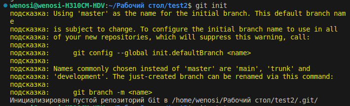
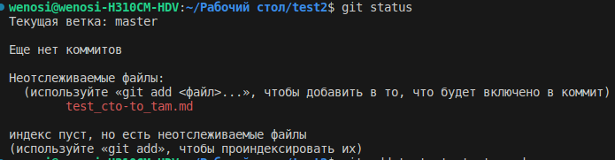
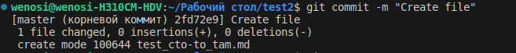
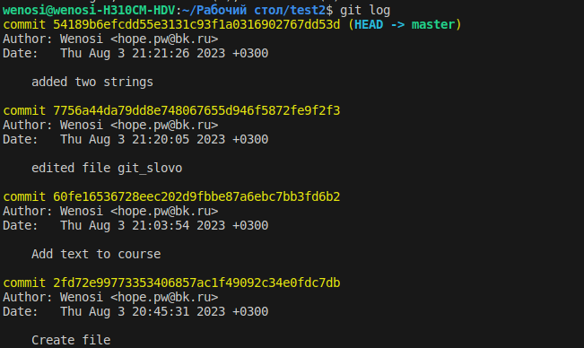
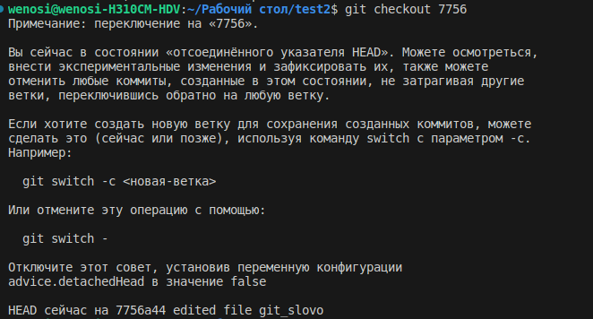
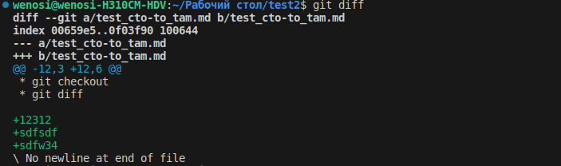

# Инструкция по работе системой контроля версий

## Firs state

### Не хватает креативности, поэтому я просто добавил изображения к названиям команд, как они работают. Своего рода тоже инструкция

* git init

* git stаtus

* git add

* git commit

* git log

* git checkout

* git diff

### Комманды второго семинара

* git branch - просмотр всех существующих веток

* git checkout branch_name - создан для того, чтоб переходить к другой ветке

* git merge - служит для слияния двух веток, использование:
переходим в ветку основную, и пишем git merge (название ветки которую нужно слить)
